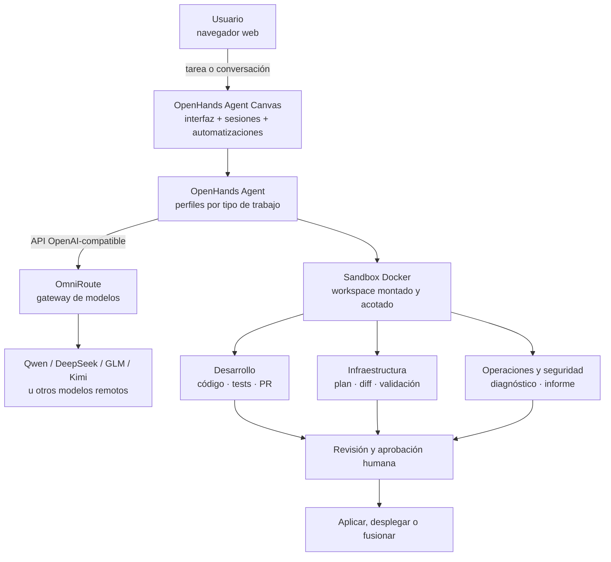

# Plataforma de agentes IA autohospedada

Plataforma web para ejecutar agentes de IA sobre proyectos de **desarrollo, infraestructura, seguridad, operaciones y documentación**. El uso principal es desarrollo de software, pero el flujo no depende de GitHub Issues ni de un tipo único de proyecto.

Se despliega con Docker tanto en una laptop (Windows + WSL2, Linux o macOS) como en una VM Linux sobre ESXi, Proxmox, Hyper-V u otro hipervisor.

> Estado: rediseño documentado y plantillas preparadas. El despliegue nuevo todavía debe verificarse de punta a punta en una máquina con Docker. No incluye modelos locales, Telegram, OpenClaw, Ollama, LiteLLM ni un enjambre propio de agentes.

## Arquitectura



## Stack

| Capa | Componente | Función |
|---|---|---|
| Interfaz y agente | OpenHands Agent Canvas | UI web, conversaciones, perfiles, automatizaciones y ejecución |
| Gateway | OmniRoute | Un único endpoint para modelos remotos compatibles |
| Modelos | Proveedores remotos | Qwen, DeepSeek, GLM, Kimi u otros configurados por el usuario |
| Aislamiento | Docker | Delimita archivos, procesos y recursos visibles para el agente |
| Código e IaC | Git + herramientas del proyecto | Tests, linters, OpenTofu, Ansible, Docker, etc. |
| Acceso privado | localhost, SSH o Tailscale | Evita publicar el agente directamente en Internet |
| Seguridad | Gitleaks + pre-commit | Reduce el riesgo de filtrar credenciales |

OmniRoute es gratuito y autohospedado, pero **no vuelve gratuitos los modelos**. Cada proveedor conserva sus cuotas y condiciones. Para costo adicional USD 0, conecta solo rutas gratuitas comprobadas, desactiva recargas y detén la tarea al agotarse la cuota.

## Flujo de trabajo

1. Abres Agent Canvas desde el navegador.
2. Seleccionas un workspace y un perfil: desarrollo, infraestructura, seguridad, operaciones o documentación.
3. OpenHands planifica y solicita confirmación cuando la acción es sensible.
4. El agente trabaja dentro del directorio montado en Docker.
5. OmniRoute dirige cada petición al modelo remoto configurado.
6. Las herramientas deterministas validan el resultado.
7. El sistema entrega un PR, plan de infraestructura, informe o artefacto.
8. Una persona revisa antes de fusionar, desplegar o aplicar cambios.

Para infraestructura, `plan`, `check` y `diff` pueden automatizarse. `apply`, despliegues, cambios de firewall, rotación de secretos y eliminaciones requieren aprobación humana.

## Inicio rápido local

Requisitos: Docker Engine o Docker Desktop con integración WSL2.

```bash
git clone https://github.com/marksato13/self-hosted-ai-devops.git
cd self-hosted-ai-devops
cp .env.example .env
./scripts/preparar.sh
# Completa .env y luego:
docker compose --env-file .env -f infra/docker-compose.yml up -d
```

Abre `http://localhost:8000/canvas`. Después configura el perfil LLM según [modelos remotos](docs/modelos-remotos.md).

En este WSL Docker todavía no está habilitado; activa **Docker Desktop → Settings → Resources → WSL Integration** antes de ejecutar el Compose.

## Despliegue en una VM Linux

La opción recomendada es Ubuntu Server 24.04 LTS, 4 vCPU, 8 GB de RAM y 50 GB de disco. La VM no necesita GPU porque los modelos son remotos.

Consulta [instalación en VM](docs/instalacion-vm.md). Mantén los puertos en loopback y accede mediante túnel SSH o Tailscale; no redirijas el puerto 8000 en el router.

## Documentación

- [Arquitectura y alcance](docs/arquitectura.md)
- [Instalación local y WSL2](docs/instalacion-local.md)
- [Instalación en VM Linux](docs/instalacion-vm.md)
- [Modelos remotos y OmniRoute](docs/modelos-remotos.md)
- [Perfiles y flujos](docs/flujos.md)
- [Proyectos de referencia](docs/proyectos-referencia.md)
- [Patrones adoptados](docs/patrones-adoptados.md)
- [Plan de implementación](docs/plan-implementacion.md)
- [Seguridad](docs/seguridad.md)
- [Operación y diagnóstico](docs/runbook.md)
- [Especificación de la VM](infra/vm-linux.md)

## Principios

- Un solo orquestador principal: OpenHands.
- Sin modelos locales por ahora.
- Ningún secreto en Git.
- Menor privilegio y workspace explícito.
- Acciones irreversibles siempre humanas.
- Cambios de código e infraestructura mediante revisión.
- No afirmar que una ruta es gratuita sin comprobar su cuota vigente.

## Verificación

```bash
./scripts/verificar.sh
```

La validación completa del Compose requiere Docker. Las plantillas fijan OmniRoute por digest; Agent Canvas se deja configurable mediante `OPENHANDS_IMAGE` para poder fijar una versión probada antes de producción.
