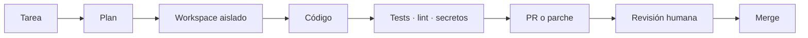
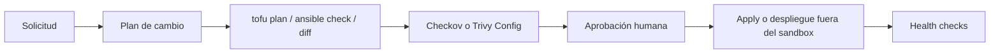

# Perfiles y flujos

## Perfiles

| Perfil | Acceso normal | Salida esperada | Aprobación |
|---|---|---|---|
| Desarrollo | repositorio, tests y linters | rama o PR | merge humano |
| Infraestructura | IaC y entornos de prueba | plan, diff e informe | obligatoria para apply |
| Seguridad | código, configuración y escáneres | hallazgos priorizados | obligatoria para remediación sensible |
| Operaciones | logs y comandos de lectura | diagnóstico y runbook | obligatoria para cambios |
| Documentación | fuentes y archivos Markdown | documentación revisable | revisión normal |

Los perfiles no son procesos permanentes separados. Son configuraciones de Agent Canvas con instrucciones, modelo y herramientas adecuadas.

## Desarrollo



Usa ramas y PR. El agente no escribe directamente en `main`. El comando de validación proviene del propio repositorio objetivo.

## Infraestructura



El agente puede preparar IaC y ejecutar validaciones sin credenciales de producción. No debe recibir acceso directo al hipervisor, firewall, backup o nube durante la fase inicial.

## Seguridad y operaciones

Empieza en modo lectura. La salida debe separar hechos, hipótesis, riesgo, evidencia y siguiente acción. Una corrección automática solo se habilita cuando exista rollback probado.

## Contrato de resultado

Toda tarea debería terminar con:

```json
{
  "tipo": "pull_request | plan_infra | informe | artefacto",
  "estado": "completado | bloqueado | requiere_aprobacion",
  "riesgo": "bajo | medio | alto",
  "validaciones": [],
  "cambios": [],
  "pendientes": []
}
```

No es una API implementada; es una convención para que las salidas sean revisables y no queden solo como conversación.
